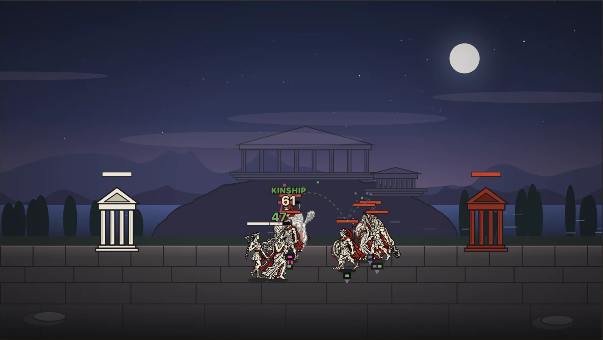

# Mythos Unbound

**Gods remember their grudges.** Mythos Unbound is a free browser battler where 66 gods, titans and
heroes fight harder, or refuse to fight at all, depending on who they're facing.

### [▶ Play in your browser](https://dhuovinen.github.io/mythos-unbound/play/) · [Website](https://dhuovinen.github.io/mythos-unbound/) · [Trailer](https://www.youtube.com/channel/UCBpBE4U2oinlcRt12nOFMgg)



## Blood remembers

Every unit knows who it is facing. Parents, children, lovers, rivals and killers all change how a
unit fights, and the effects come straight from the myths:

| Matchup | Effect |
|---|---|
| **Cronus → his children** | *Filicide*: the Devourer deals ×1.5 damage |
| **Zeus → Cronus** | *Usurpation*: a child turned on its father deals ×1.6 |
| **Ares ↔ Aphrodite** | *Entranced*: lovers refuse to strike each other |
| **Thor ↔ Jörmungandr** | *Vengeance*: each killed the other, so both deal ×2 and ignore armour |
| **Osiris → Set** | *Vengeance*: the murdered king strikes his brother through armour |

Blood doesn't cross pantheons: fight a different mythology and every grudge goes quiet. That can
also be a deliberate strategy.

## Features

- **Three pantheons, 66 units.** Greek, Norse and Egyptian, each with its own family tree,
  battlefield and inked portraits.
- **Draft from the family tree.** Your three opening picks are revealed to an opponent who drafts
  blind at the same time.
- **14 blood-tie effects** between enemies and allies, all resolved from a genealogy graph.
- **A strategy consultant** that explains the board. Its advice uses the same reasoning your opponent
  uses to make its moves.
- **Full battle log** with exact attack arithmetic, plus an exportable review packet.

## Run it locally

```bash
npm install
npm run dev        # http://localhost:3033
npm test           # vitest
npm run build:site # landing page + game -> _site/
```

Built with TypeScript, Vite and Canvas 2D, with no runtime dependencies. Every push to `main`
runs the tests and deploys the site to GitHub Pages.

## License

The source code is [MIT](LICENSE). The artwork, portraits, sprites and trailer media are
**all rights reserved**; see [ASSETS-LICENSE.md](ASSETS-LICENSE.md).
